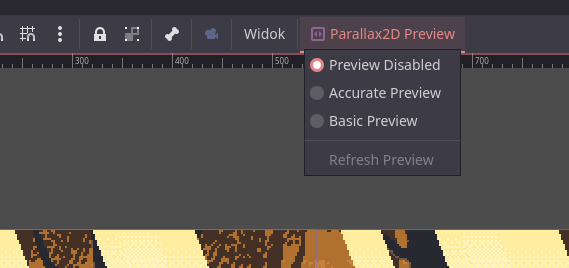
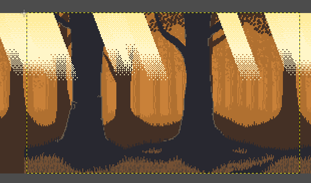

#  Godot Parallax2D Preview

This plugin enables editor previewing of Parallax2D nodes in Godot Engine.

## How to use

Add this plugin to your project and enable it.

You need a scene with Parallax2D nodes. Then click any Node2D or Control and a button will appear at the top. Clicking it opens a menu.

- **Preview Disabled:** The parallax will not be previewed.
- **Accurate Preview:** Shows how the parallax will appear in-game.
- **Basic Preview:** Previews the parallax based on editor view.
- **Refresh Preview:** Recreates the preview, in case some information is outdated.

Enable Accurate or Basic preview to start previewing your parallax. If there is no Parallax2D node in your scene, a warning will be printed.

The preview works by writing `screen_offset` property of your nodes. You can modify your nodes and they will update in real time. Disabling preview will return your nodes to normal. The preview does not support `autoscroll`.

### Accurate Preview

In this mode, the plugin will display a rectangle in the center of your editor viewport.

The rectangle has the same size as the project's configured window size. The parallax within the rectangle will match what appears in game if the camera is at the position of the rectangle.

### Basic Preview

In this mode, the plugin will simply move Parallax2D nodes based on the top-left corner of your viewport, so effectively it uses editor view as "game camera".

### Refresh Preview

The plugin will read screen size and Parallax2D node list when the preview is enabled. If any of this information is outdated, you need to update the preview manually using this option.

___
You can find all my addons on my [profile page](https://github.com/KoBeWi).

